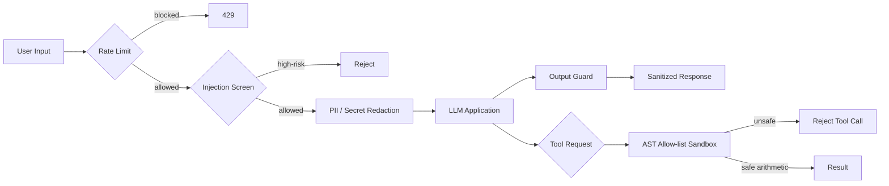
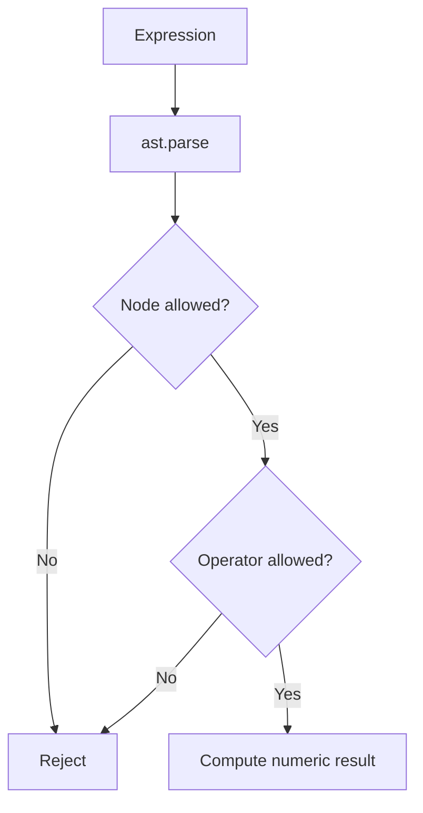

# LLM Security Guardrail Middleware

[](https://github.com/Lonfea/llm-security-guardrails/actions/workflows/ci.yml)


A reusable security boundary for LLM applications that screens prompt injection, redacts sensitive data, enforces request quotas, sanitizes outputs and exposes only constrained tool execution.

## Security boundary



## Threat-control matrix

| Threat | Control in this project |
|---|---|
| Instruction override | deterministic high-signal injection patterns |
| Secret/PII leakage | input and output redaction |
| Request abuse | sliding-window per-client rate limiter |
| Arbitrary code execution | AST-based arithmetic allow-list |
| Unsafe model output | output validation/sanitization |
| Tool escalation | names, calls, imports, attributes and arbitrary execution rejected |

## Sandboxed calculator

The calculator **never calls Python `eval` or `exec`**.



Imports, names, function calls, attribute access, comprehensions, file/network access and arbitrary code are rejected.

## API

- **POST `/guard/input`** — screen/redact incoming content
- **POST `/guard/output`** — sanitize outgoing content
- **POST `/tools/calculate`** — constrained arithmetic execution

## Run locally

```bash
git clone https://github.com/Lonfea/llm-security-guardrails.git
cd llm-security-guardrails
python -m venv .venv
source .venv/bin/activate
pip install -e ".[dev]"
uvicorn app.main:app --reload
```

## What this demonstrates

Security middleware design, threat modeling, fail-closed tool constraints, PII/secret handling, rate limiting and tests for adversarial control-plane behavior.

## Security limitations

This repository does **not** claim perfect prompt-injection detection. Additional controls are needed for indirect injection inside retrieved documents, poisoned data, compromised upstream tools, authorization mistakes, distributed rate limiting and true isolation of arbitrary user code.

That distinction is intentional: production AI security requires layered controls rather than one regex or one classifier.
